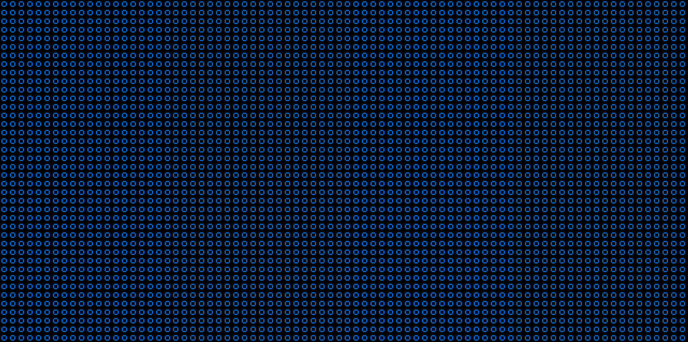
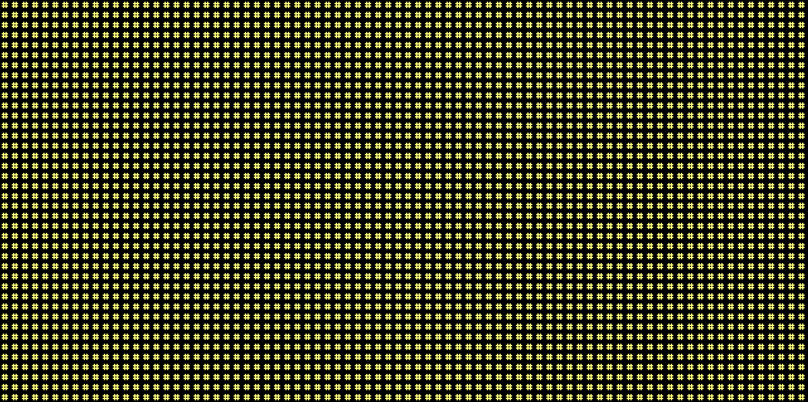
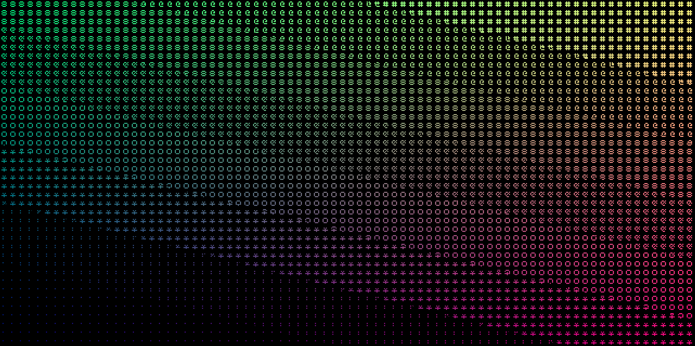

# ascii-filter

本記事は[Processing Advent Calendar2024](https://adventar.org/calendars/9929)の記事です。

## アスキーとは

$7$ビットで$0b0000000$から$0b1111111$までの番号を使い、数値に対応する文字や数字を定めたものです。

- 英語アルファベットの大文字と小文字
- 記号
- $0$ ~ $9$までの数字
- 制御文字

たとえば$0b1000001$と言う数字は英大文字の$A$を表しています。

アスキーはUnicodeのUTF-8と互換性があります。

## アスキーフィルターとは

画像や映像をピクセル単位でアスキー文字に置き換えるフィルターです。

画像や映像の色と座標で表示する文字が変わります。

### 使用する文字

`. : * o & 8 @ #`の8つです。

### 単色RGB

色によって文字が明確に変化しています。たとえば青の場合```o```と言う文字、黄色の場合は```#```とうい文字が描画されます。





### グラデーション

色が滑らかに変化しているため文字も滑らかに変化しています。また欠点として滑らかに変化しているためアスキーでない文字も描画されます。



## 参考文献

- [プログラマのための文字コード技術入門](https://gihyo.jp/book/2019/978-4-297-10291-3)
- [Ascii Art](https://www.shadertoy.com/view/lssGDj)
- [PixiJS Filters](https://github.com/pixijs/filters/tree/main/src/ascii)
